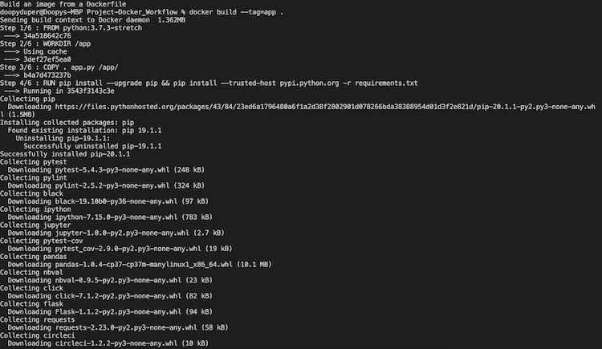
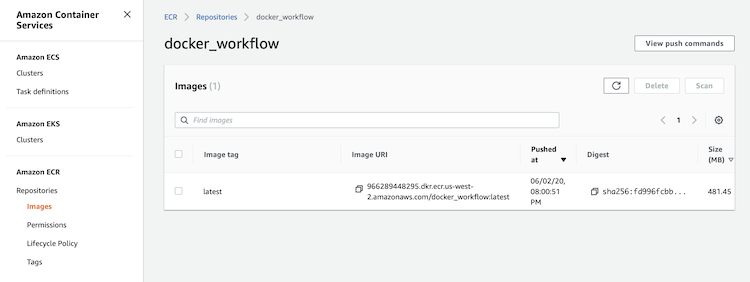

# Project-Docker_Workflow
Udacity's Cloud DevOps Nanodegree Course 4 Project

Part 1 - Containerizing an application with Docker

1) Setup a local development environment
- Installed python
- Build and executed packages

2) Developed a Makefile to automate the build process
- Setup local environment using bash scripts

- Installing packages using pip3
- Testing python code using pytest
- Validating build configurations using CircleCI

- Linting Dockerfile with hadolint
- Linting python file with pylint
3) Containerize a python app using Docker
- Local build and verify packages installed successfully
`docker build --tag=app .`

- Check to see that it was built successfully
`docker image ls`
- Run the docker to see if it was setup properly
`docker run -p 80:80 app`
- Deploy Docker image to AWS Elastic Container Registry

To run the Docker image in your server, just execute the following code:
- `docker pull 966289448295.dkr.ecr.us-west-2.amazonaws.com/docker_workflow:latest`
- `docker run 966289448295.dkr.ecr.us-west-2.amazonaws.com/docker_workflow`

[Part 2](https://github.com/dSalazar10/Project-Kubernetes_Workflow)
