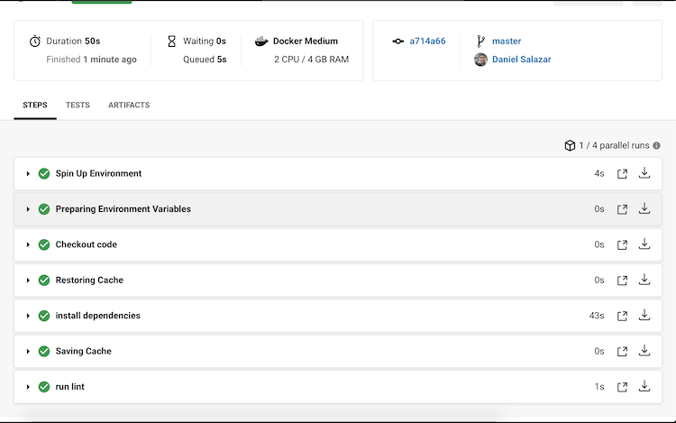

# Project-Docker_Workflow
Udacity's Cloud DevOps Nanodegree Course 4 Project

1) Setup a local development environment
- Installed python
- Build and executed packages

2) Developed a Makefile to automate the build process
- Setup local environment using bash scripts
- Installing packages using pip3
- Testing python code using pytest
- Validating build configurations using CircleCI
- Linting Dockerfile with hadolint
- Linting python file with pylint

3) Containerize a python app using Docker
- Local build and verify packages installed successfully
- Deploy Docker image to AWS Elastic Container Registry

